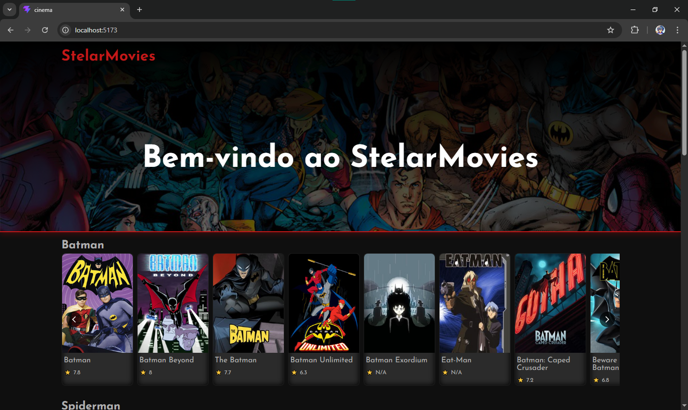

# 🎬 StelarMovies

Site de um cinema desenvolvido após uma análise de concorrência das plataformas de filmes e series online mais populares e inspirado nelas.

---

## 👁️ Visualização



---

## 🎯 Objetivo
Desenvolver uma aplicação utilizando api funcionais aplicando conceitos modernos, codigo limpo e componentes reutilizaveis.

---

## 🛠️ Tecnologias e Conceitos
O projeto foi construído utilizando as melhores práticas do front-end:

* **React**: Biblioteca principal para a construção da interface modular e baseada em componentes.
* **TypeScript**: Adicionado para garantir tipagem estática, reduzindo bugs em tempo de desenvolvimento e melhorando a manutenção do código.
* **CSS Modules & SCSS**: Utilizados em conjunto para estilização escopada, evitando conflitos de classes e permitindo o uso de variáveis e aninhamentos avançados.
* **Mobile First**: Metodologia de design focada em criar a experiência ideal para telas menores primeiro, expandindo progressivamente para desktop.
* **Hooks**: Uso de `useState`, `useEffect` e custom hooks para controle de estados globais (como carrinho e busca) e ciclo de vida.

---

## 🔄 Como Rodar o Projeto
Para executar este projeto localmente, siga os passos abaixo:

1. Clone o repositório:
  ```bash
  git clone [https://github.com/Herdes-s/StelarMovies](https://github.com/Herdes-s/StelarMovies)
  ```

2. Acesse a pasta do projeto:
  ```Bash
  cd StelarMovies
  ```

3. Instale as dependências:
  ```Bash
  npm install
  ```

4. Inicie o servidor de desenvolvimento:
  ```Bash
  npm start
  ```

O projeto abrirá automaticamente no seu navegador no endereço http://localhost:5173.

---

## 🔗 Link de Acesso
Confira o projeto online: Em andamento...

---

## 👤 Autor
Desenvolvido por Ernand Soares.